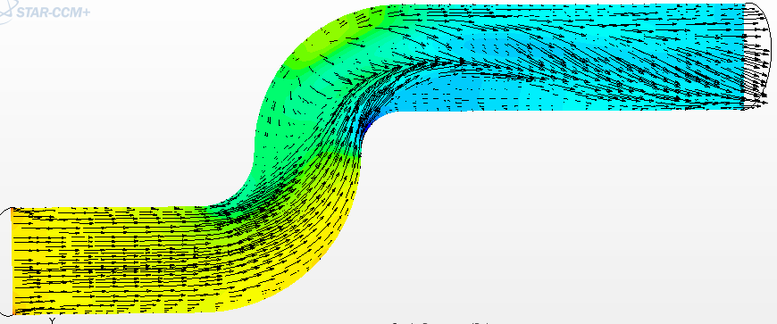

# Thermal Distribution Analysis

---

# Engineering problem

Uneven temperature distribution
may generate thermal stress,
material expansion
and performance instability.

---

# Analysis overview

Temperature distribution inside
an engineering component
was analyzed to identify
critical thermal regions
and thermal gradients.

---

# Key observations

• localized hot spots  
• uneven thermal distribution  
• thermal gradient regions  
• heat concentration behavior  

---

# Engineering relevance

Thermal distribution analysis helps improve:

• thermal stability  
• component reliability  
• heat management  
• structural durability  
